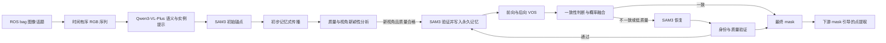

# SAM3 锚定的长时记忆与双向验证构件分割方案

> 文档状态：方法设计稿。本文档用于指导 Section 4.2.1 的实现与论文写作，不代表该方案已经完成实验验证。除已注明的当前设置外，所有阈值均需通过验证集或消融实验确定。

## 1. 目标与方法边界

本方案从 ROS bag 的指定图像话题中提取时间有序的 RGB 图像，并为每一帧生成目标预制构件的完整二值掩膜。它针对以下失效现象设计：

- 非关键帧中的掩膜出现孔洞或破碎；
- 掩膜超出构件边界，包含背景区域；
- 掩膜未能完整覆盖构件；
- 逐帧光流传播产生累积漂移；
- 构件由长边视角向短边视角转换时，外观变化导致目标身份丢失。

掩膜估计阶段仅使用图像、图像时间关系和图像模型内部特征。LiDAR 点云及其图像投影不参与掩膜生成、修正、关键帧判断或候选掩膜选择，避免图像--LiDAR配准误差影响分割。最终掩膜确定后，才允许在下游模块中使用掩膜提取构件点云。

方法的输入与输出为：

$$
\left(\mathcal{B},\mathcal{T}_{I},d,\Theta\right)
\longmapsto
\mathcal{M}
=
\left\{M_t\right\}_{t=1}^{T},
$$

其中，$\mathcal{B}$ 为 bag 文件，$\mathcal{T}_{I}$ 为图像话题，$d$ 为用户提供的构件描述，$\Theta$ 为模型与判定参数，$M_t$ 为第 $t$ 帧的最终构件掩膜。

## 2. 设计依据

原有方法将上一帧掩膜通过稠密光流变形到当前帧，并将该结果作为当前掩膜或 SAM3 输出的硬约束。该设计隐含了相邻帧中可见像素能够稳定对应的假设。对于低纹理混凝土表面、运动模糊、较大视角变化、遮挡及新显露表面，该假设容易失效。双向光流可以发现部分不一致像素，但无法恢复传播过程中已经丢失的构件区域。

因此，本方案将光流传播替换为对象级长时记忆分割。长时记忆保存经过验证的目标外观和形状信息，并通过多个锚点而非单个前序掩膜维持目标身份。SAM3负责建立和恢复高质量锚点；记忆式视频对象分割负责低成本的连续帧预测；前向--后向验证负责识别传播失效；自动视角判定负责补充长边、斜视和短边等具有代表性的锚点。

## 3. 总体结构



永久锚点记忆与近期工作记忆共同构成两级记忆：

$$
\mathbb{M}_t
=
\mathbb{M}^{\mathrm{anchor}}_t
\cup
\mathbb{M}^{\mathrm{work}}_t.
$$

$\mathbb{M}^{\mathrm{anchor}}_t$ 保存由 SAM3 验证的代表性视角和恢复帧，不因后续低质量预测而被覆盖；$\mathbb{M}^{\mathrm{work}}_t$ 仅保存近期高置信预测，用于适应连续的局部外观变化。

## 4. 从 bag 图像话题构建帧序列

### 4.1 图像读取

令 $\mathcal{D}_{\mathrm{bag}}$ 表示 bag 图像读取器，则图像序列表示为：

$$
\mathcal{I}
=
\mathcal{D}_{\mathrm{bag}}\!\left(\mathcal{B},\mathcal{T}_{I}\right)
=
\left\{\left(I_t,\tau_t,n_t\right)\right\}_{t=1}^{T},
$$

其中，$I_t$ 为解码后的 RGB 图像，$\tau_t$ 为消息时间戳，$n_t$ 为原始消息序号。读取器应兼容实际 bag 中使用的非压缩图像消息或压缩图像消息，并完成以下检查：

- 按时间戳稳定排序，并以消息序号处理相同时间戳；
- 记录解码失败、空图像和异常分辨率帧；
- 保留原始时间戳与输出帧编号的映射；
- 不通过固定帧率重采样改变原始帧顺序；
- 将图像旋转、畸变校正或颜色转换配置记录到元数据中。

建议生成如下索引，而不是仅导出无时间信息的图片：

```text
frame_id, bag_timestamp, source_index, image_path, decode_status
000000,  ...,           ...,          ...,        valid
000001,  ...,           ...,          ...,        valid
```

### 4.2 图像质量预检查

图像质量检查不直接删除所有低质量帧，因为它们仍需要最终掩膜。检查结果用于限制锚点选择。对每帧计算清晰度、曝光有效性和图像边界完整性，形成图像质量项 $q_t^{\mathrm{img}}\in[0,1]$。严重模糊或曝光异常的帧可以被分割，但不能自动写入永久锚点记忆。

## 5. SAM3 语义初始化与锚点建立

### 5.1 初始目标身份

用户描述 $d$ 由 Qwen3-VL-Plus 转换为：

$$
\left(l,m,\mathbf{c}_s\right)
=
\mathcal{G}\!\left(I_s,d\right),
$$

其中，$l$ 为 SAM3 可用的语义标签，$m\in\{\texttt{one},\texttt{all}\}$ 为实例选择方式，$\mathbf{c}_s$ 为种子帧 $I_s$ 中的正点提示。SAM3 生成候选掩膜集合：

$$
\mathcal{C}_s
=
\mathcal{S}\!\left(I_s;l,m,\mathbf{c}_s\right).
$$

当只分割一个具体构件时，最终候选应同时满足语义描述、点提示包含关系和掩膜质量要求。通过验证的掩膜记为 $M_s^A$，并写入永久锚点记忆。

### 5.2 锚点验证

“SAM3 锚点”不等于未经检查的 SAM3 输出。锚点至少需要通过以下图像质量条件：

- 前景平均概率高于设定阈值；
- 主体连通域占掩膜面积的比例足够高；
- 非真实孔洞比例足够低；
- 构件没有因图像边界而发生严重截断；
- 掩膜面积、位置和轮廓与相邻可靠预测不存在异常突变；
- 若有多个候选实例，其对象特征与已有永久锚点最接近。

首个锚点建议进行人工确认。后续锚点可以自动验证，但所有自动判定指标及阈值必须保存到日志，便于复查。

## 6. 对象中心的紧凑记忆

### 6.1 记忆内容

视频记忆通常保存编码后的特征和掩膜信息，而不是保存全部原始 RGB 图像。本方案进一步采用对象中心的局部记忆。对锚点 $a$，定义：

$$
\mathcal{A}_a
=
\left\{
\mathbf{z}_a,
\mathbf{F}_a^{\Omega},
P_a^{\Omega},
S_a^{\Omega},
\mathbf{b}_a,
q_a
\right\}.
$$

各变量含义如下：

- $\mathbf{z}_a$：构件整体的低维对象表征，用于身份匹配；
- $\mathbf{F}_a^{\Omega}$：对象局部区域 $\Omega_a$ 内的编码特征；
- $P_a^{\Omega}$：局部前景概率图；
- $S_a^{\Omega}=\operatorname{SDF}(M_a^{\Omega})$：局部掩膜的有符号距离场，用于表达轮廓；
- $\mathbf{b}_a$：目标框的位置、尺寸和长宽比；
- $q_a$：锚点质量分数。

局部区域 $\Omega_a$ 包含构件及少量邻近背景。背景边缘用于区分构件边界与相似纹理。该边缘宽度不固定为 10% 或 20%，而根据目标定位不确定性和相邻帧运动幅度确定。定位稳定时使用较小边缘，定位不稳定时适当增大，但始终限制在图像范围内。

### 6.2 现成模型与定制结构的边界

若直接采用未经修改的 SAM 2、Cutie 或其他 VOS 模型，应使用其原生 memory encoder 和 memory bank，不应声称已经实现了独立的 SDF 记忆通道。此时，$S_a^{\Omega}$ 仅用于外部质量评估和轮廓一致性检查。

若要将轮廓真正写入模型记忆，需要实现定制 memory adapter，例如：

$$
\mathbf{V}_a
=
\mathcal{E}_{\mathrm{mem}}\!\left(
\mathbf{F}_a^{\Omega},
P_a^{\Omega},
S_a^{\Omega}
\right),
$$

其中，$\mathcal{E}_{\mathrm{mem}}$ 为需要训练或适配的记忆编码器。该定制版本必须在实现和消融实验完成后才能作为正式论文方法。

### 6.3 记忆容量控制

永久记忆和工作记忆均设置容量上限：

$$
\left|\mathbb{M}^{\mathrm{anchor}}\right|\leq N_A,
\qquad
\left|\mathbb{M}^{\mathrm{work}}\right|\leq N_W.
$$

当永久记忆达到上限时，不应简单删除最早帧。优先删除同时满足“质量较低”和“与其他锚点高度相似”的冗余锚点，保留覆盖长边、斜视、短边、尺度变化和遮挡恢复的代表性锚点。工作记忆采用近期高质量帧优先策略，并拒绝低置信预测写入。

## 7. 自动视角关键帧选择

### 7.1 初步传播

初始锚点建立后，先执行一次记忆式视频分割，获得暂定概率图 $P_t^{(0)}$ 和暂定掩膜 $M_t^{(0)}$。这些结果只用于寻找新视角候选，不立即作为最终输出。每增加一批已验证锚点，应重新传播一次，以减少初始单锚点带来的偏差。

### 7.2 掩膜质量分数

对暂定掩膜定义以下归一化指标：

- $\bar p_t$：掩膜内部的平均前景概率；
- $c_t^{\mathrm{cc}}$：最大连通域面积占总前景面积的比例；
- $h_t$：封闭孔洞面积占前景面积的比例；
- $b_t$：掩膜边界落在图像边缘的比例；
- $s_t$：图像清晰度分数；
- $c_t^{\mathrm{fb}}$：前向--后向分割一致性。

质量分数定义为：

$$
q_t
=
\frac{
\nu_p\bar p_t
+\nu_c c_t^{\mathrm{cc}}
+\nu_h(1-h_t)
+\nu_b(1-b_t)
+\nu_s s_t
+\nu_f c_t^{\mathrm{fb}}
}{
\nu_p+\nu_c+\nu_h+\nu_b+\nu_s+\nu_f
}.
$$

所有 $\nu$ 均为非负权重。实际实现必须记录每个分量，而不能只保存最终 $q_t$，否则难以区分孔洞、截断、模糊和时序不一致等不同失效原因。

### 7.3 视角新颖性

为避免背景变化影响关键帧判断，所有形状和外观特征均在对象局部区域内计算。将暂定掩膜平移和缩放到统一局部坐标，记为 $\bar M_t$。令 $r_t$ 为其最小面积外接矩形的长宽比，$\mathbf{z}_t$ 为对象级外观表征。当前帧相对于永久锚点集合 $\mathbb{A}$ 的视角新颖性定义为：

$$
d_t
=
\min_{a\in\mathbb{A}}
\left[
\omega_s\left(1-\operatorname{IoU}(\bar M_t,\bar M_a)\right)
+\omega_r\left|\log\frac{r_t}{r_a}\right|
+\omega_e\left(1-\cos(\mathbf{z}_t,\mathbf{z}_a)\right)
\right].
$$

三项分别衡量归一化轮廓变化、长宽比变化和对象外观变化。长边视角向短边视角转换时，$r_t$ 和轮廓通常同时变化，因此会提高 $d_t$。仅依赖 $r_t$ 容易把漏分造成的掩膜变窄误判为新视角，所以必须同时满足质量条件。

### 7.4 新视角锚点条件

帧 $t$ 被标记为新视角候选需要同时满足：

$$
q_t\geq q_{\min},
\qquad
d_t\geq\tau_{\mathrm{view}},
\qquad
\min_{a\in\mathbb{A}}|\tau_t-\tau_a|\geq\Delta\tau_{\min}.
$$

候选帧必须由 SAM3 重新分割并通过锚点验证，才能写入永久记忆。该策略应优先保留：

- 清晰且完整的长边视角；
- 长边向短边转换过程中的代表性斜视角；
- 可见面积满足要求的短边或端部视角；
- 明显尺度变化后的高质量视角；
- 遮挡结束后的恢复视角。

视角变化很大但模糊、严重遮挡或边界截断的帧只触发恢复，不直接成为永久锚点。

## 8. 双向长时记忆分割

### 8.1 锚点区间

将已验证锚点按时间排序：

$$
\mathbb{A}
=
\left\{a_1,a_2,\ldots,a_K\right\},
\qquad
\tau_{a_1}<\tau_{a_2}<\cdots<\tau_{a_K}.
$$

对于相邻锚点区间 $[a_j,a_{j+1}]$，从左锚点向右运行前向 VOS，从右锚点向左运行后向 VOS。为了使序列两端也具备双向约束，应尽量在序列开始和结束附近建立终端锚点；若终端区域无法获得可靠锚点，则该区域只能使用单向预测，并在输出中标记较低置信度。

### 8.2 双向预测

对区间内帧 $t$，两种方向的概率图表示为：

$$
P_t^{\rightarrow}
=
\mathcal{V}_{\rightarrow}\!\left(I_t;\mathbb{M}^{\rightarrow}_t\right),
\qquad
P_t^{\leftarrow}
=
\mathcal{V}_{\leftarrow}\!\left(I_t;\mathbb{M}^{\leftarrow}_t\right).
$$

这里的前向和后向模型可以共享参数，但必须维护相互独立的工作记忆，避免一个方向的错误直接写入另一个方向。

### 8.3 前后向一致性

将概率图以阈值 $\tau_m$ 转换为临时掩膜：

$$
M_t^{\rightarrow}
=
\mathbb{I}\!\left[P_t^{\rightarrow}\geq\tau_m\right],
\qquad
M_t^{\leftarrow}
=
\mathbb{I}\!\left[P_t^{\leftarrow}\geq\tau_m\right].
$$

前后向一致性为：

$$
c_t^{\mathrm{fb}}
=
\operatorname{IoU}\!\left(
M_t^{\rightarrow},
M_t^{\leftarrow}
\right).
$$

还应保存像素级分歧图：

$$
D_t^{\mathrm{fb}}
=
\left|P_t^{\rightarrow}-P_t^{\leftarrow}\right|,
$$

用于定位边界偏移、局部孔洞和整实例漂移。单个 IoU 分数不能说明错误发生在构件内部还是边界，因此论文可同时展示 $c_t^{\mathrm{fb}}$ 与 $D_t^{\mathrm{fb}}$。

### 8.4 概率融合

若 $c_t^{\mathrm{fb}}\geq\tau_{\mathrm{fb}}$ 且质量检查通过，则先融合概率，再生成二值掩膜：

$$
P_t
=
\frac{
w_t^{\rightarrow}P_t^{\rightarrow}
+w_t^{\leftarrow}P_t^{\leftarrow}
}{
w_t^{\rightarrow}+w_t^{\leftarrow}
},
\qquad
M_t
=
\mathbb{I}\!\left[P_t\geq\tau_m\right].
$$

$w_t^{\rightarrow}$ 和 $w_t^{\leftarrow}$ 由各方向的预测置信度和距离最近锚点的时间距离确定。禁止使用 $M_t^{\rightarrow}\cap M_t^{\leftarrow}$ 作为最终结果，因为硬交集会保留两个方向中的漏分并扩大孔洞。

## 9. SAM3 失效恢复与重新锚定

### 9.1 触发条件

满足任一条件时触发 SAM3 恢复：

- $c_t^{\mathrm{fb}}<\tau_{\mathrm{fb}}$；
- $q_t<q_{\min}$；
- 掩膜面积相对邻近可靠帧发生异常变化；
- 主体连通域比例过低或孔洞比例过高；
- 掩膜触及图像边界的程度异常；
- 两个方向均给出低前景概率。

### 9.2 当前帧提示生成

前后向平均概率为：

$$
\bar P_t
=
\frac{
w_t^{\rightarrow}P_t^{\rightarrow}
+w_t^{\leftarrow}P_t^{\leftarrow}
}{
w_t^{\rightarrow}+w_t^{\leftarrow}
}.
$$

当前正点提示选为：

$$
\mathbf{c}_t
=
\arg\max_{\mathbf{u}}\bar P_t(\mathbf{u}).
$$

若最高概率低于最低提示置信度，则不能依赖该点，应回退到最近永久锚点维护的图像目标跟踪位置或请求人工确认。不能将一个低置信度像素作为可靠正点强制写入 SAM3。

### 9.3 多候选身份选择

SAM3 在帧 $t$ 产生候选集合 $\mathcal{C}_t=\{M_{t,j}^{S}\}$。对候选 $j$，提取其对象表示 $\mathbf{z}_{t,j}^{S}$，并计算与永久锚点的最大身份相似度：

$$
s_{t,j}^{\mathrm{id}}
=
\max_{a\in\mathbb{A}}
\cos\!\left(
\mathbf{z}_{t,j}^{S},
\mathbf{z}_a
\right).
$$

候选选择不能只取最大面积掩膜。应联合考虑身份相似度、SAM3 置信度、掩膜质量以及与前后向高置信区域的空间一致性。恢复结果只有在质量检查通过后才能加入永久记忆；否则仅作为当前帧输出并标记为低置信度，或交由人工复核。

## 10. 最终掩膜后处理

后处理 $\mathscr{P}$ 仅修正小型离散噪声，不负责弥补模型产生的大面积漏分。建议包括：

- 删除面积低于阈值的小型离散连通域；
- 当目标确定为单一连通实体时保留主体连通域；
- 仅填充面积低于阈值的封闭孔洞；
- 对具有真实孔洞的构件关闭自动孔洞填充；
- 不使用固定大尺度膨胀扩大掩膜；
- 保存后处理前后的掩膜，便于分析模型误差与后处理影响。

最终输出除二值掩膜外，还应保存概率、质量和来源：

```text
frame_id
timestamp
mask_path
probability_path
source: fused | sam3_recovery | one_direction
quality_score
forward_backward_iou
nearest_anchor_ids
is_permanent_anchor
failure_flags
```

## 11. 完整算法

```text
Input:
    bag B, image topic T_I, user description d
    SAM3 model S, memory-VOS model V
    thresholds and memory limits Theta

Output:
    final masks {M_t}, probability maps {P_t}, anchor set A, quality log Q

1. Decode the image topic and construct the timestamp-ordered sequence I.
2. Select a clear seed frame I_s.
3. Use Qwen3-VL-Plus to obtain semantic label l and instance prompt c_s.
4. Run SAM3 and verify the seed mask M_s^A.
5. Insert M_s^A into permanent anchor memory.

6. Repeat until no accepted new-view anchor is found or the anchor limit is reached:
    a. Run a preliminary memory-VOS pass from the current anchors.
    b. Compute mask quality q_t and viewpoint novelty d_t for candidate frames.
    c. Apply temporal non-maximum suppression to nearby candidates.
    d. Re-segment accepted candidates with SAM3.
    e. Verify identity and mask quality.
    f. Insert verified candidates into permanent memory.

7. Sort all permanent anchors by timestamp.
8. For each adjacent anchor interval:
    a. Run forward VOS from the left anchor.
    b. Run backward VOS from the right anchor with independent working memory.
    c. Compute bidirectional agreement and mask-quality indicators.
    d. If agreement and quality pass, fuse probability maps.
    e. Otherwise, invoke SAM3 recovery and verify the recovered instance.
    f. Write only high-confidence recent predictions into working memory.

9. Apply conservative mask post-processing.
10. Save masks, probability maps, anchor metadata, failure flags, and quality logs.
11. After all masks are finalised, make them available to the downstream LiDAR extraction module.
```

## 12. 软件模块建议

建议将程序拆分为以下模块，避免 bag 读取、模型推理和质量判定相互耦合：

```text
segmentation_pipeline/
├── bag_image_reader.py          # bag 图像话题、时间戳和解码
├── grounding_adapter.py         # Qwen3-VL-Plus 输出转换
├── sam3_anchor.py               # SAM3 推理、候选选择和恢复
├── memory_vos_adapter.py        # 统一封装 SAM2/Cutie/其他 VOS
├── compact_memory.py            # 永久记忆、工作记忆及淘汰策略
├── mask_quality.py              # 概率、连通性、孔洞、截断和清晰度
├── viewpoint_selector.py        # 轮廓、长宽比和对象特征新颖性
├── bidirectional_fusion.py      # 双向传播、一致性和概率融合
├── mask_postprocess.py          # 保守后处理
├── metadata_writer.py           # 质量日志与输出索引
└── run_segmentation.py          # 配置读取与总体调度
```

`memory_vos_adapter.py` 应统一提供以下接口：

```text
initialise(anchor_frame, anchor_mask)
add_permanent_anchor(frame_id, image, mask, quality)
predict(frame_id, image, direction)
update_working_memory(frame_id, image, probability, quality)
reset_working_memory(direction)
export_memory_statistics()
```

这样可以在不改动其他模块的情况下比较不同 VOS 主干。

## 13. 配置参数

以下参数需要在实现中显式配置并记录：

| 参数 | 含义 | 当前状态 |
|---|---|---|
| `bag_path` | bag 文件路径 | 待配置 |
| `image_topic` | RGB 图像话题 | 待配置 |
| `seed_frame` | 初始锚点帧 | 待配置或自动选择后确认 |
| `sam3_confidence` | SAM3 候选置信度阈值 | 当前稿曾使用 0.3，需在新流程中重新验证 |
| `mask_threshold` | $\tau_m$，前景概率阈值 | 待验证 |
| `fb_iou_threshold` | $\tau_{\mathrm{fb}}$，双向一致性阈值 | 待验证 |
| `quality_threshold` | $q_{\min}$，锚点和输出质量阈值 | 待验证 |
| `view_novelty_threshold` | $\tau_{\mathrm{view}}$ | 待验证 |
| `min_anchor_time_gap` | $\Delta\tau_{\min}$ | 待验证 |
| `max_anchor_memory` | $N_A$ | 根据视角数量和显存确定 |
| `max_working_memory` | $N_W$ | 根据序列长度和显存确定 |
| `context_margin_rule` | ROI 边缘与定位不确定性的映射 | 待实现 |
| `max_hole_area` | 可自动填充的最大孔洞面积 | 需区分真实孔洞 |
| `recovery_prompt_min_confidence` | 自动正点提示的最低可信度 | 待验证 |

所有阈值应通过带人工真值的独立验证帧确定，不能直接在最终测试序列上调节。

## 14. 计算与内存效率

效率来自三个方面：

1. SAM3 不再按固定帧间隔运行，仅在初始锚点、新视角候选和分割失效时运行。
2. 记忆保存下采样对象特征、概率和少量上下文，不保存所有原始全分辨率图像。
3. 永久锚点和工作记忆均受容量限制，冗余视角按质量与相似性淘汰。

应记录以下效率指标：

- 每个 bag 的 SAM3 调用次数；
- VOS 单帧平均时间与峰值时间；
- 峰值 GPU 显存和主机内存；
- 永久锚点数量与工作记忆峰值长度；
- 每分钟视频的总处理时间；
- SAM3 恢复帧比例。

不能仅报告平均帧率，因为自动关键帧和恢复机制会使不同帧的计算量不同。

## 15. 验证与消融实验

### 15.1 分割指标

从不同 bag、视角和运动状态中抽取人工标注帧，报告：

- mask IoU 或区域 $J$ 指标；
- boundary $F$ 指标；
- 孔洞面积比例；
- 主体连通域比例；
- 目标身份切换次数；
- 跟踪失败率和 SAM3 恢复成功率。

测试帧应覆盖长边、斜视、短边、运动模糊、部分遮挡、构件接近图像边缘和背景相似构件等情况。

### 15.2 消融设置

建议至少比较：

1. SAM3 每帧独立分割；
2. 原光流传播与固定间隔 SAM3；
3. 单向 memory VOS；
4. 双向 memory VOS，不进行自动锚点选择；
5. 双向 memory VOS 加视角锚点；
6. 完整方案，包括失效触发的 SAM3 恢复；
7. 若实现定制 SDF 记忆，再增加移除 SDF 通道的消融。

除精度外，还应比较 SAM3 调用次数、运行时间和内存峰值，以判断自动锚点与紧凑记忆是否真正提高效率。

## 16. 主要风险与保护措施

### 16.1 前后向结果一致但同时错误

两个方向可能同时漂移到相似构件，使 $c_t^{\mathrm{fb}}$ 较高。保护措施是同时检查永久锚点身份相似度、面积变化和对象位置连续性，不能只依赖前后向 IoU。

### 16.2 短边视角被漏分误判为新视角

漏分会改变轮廓和长宽比。保护措施是先满足 $q_t\geq q_{\min}$，再判断 $d_t$；新视角候选还必须经过 SAM3 重新分割。

### 16.3 错误预测污染工作记忆

只有同时通过概率、形状和双向一致性检查的预测才允许写入工作记忆。SAM3 恢复帧只有通过身份和质量验证才写入永久记忆。

### 16.4 真实结构孔洞被后处理填充

若构件本身具有开孔，必须关闭对应区域的自动孔洞填充，或仅填充远小于真实孔洞尺度的孤立孔洞。

### 16.5 完全遮挡或严重模糊

完全不可见时不应生成虚假的高置信 mask。该帧应输出低置信度状态；重新可见后由永久锚点和 SAM3 恢复身份。

## 17. 与 Manuscript Section 4.2.1 的对应关系

论文正文只需保留方法的核心逻辑：

- bag 图像序列定义；
- SAM3 初始和恢复锚点；
- 永久记忆与工作记忆；
- 质量约束下的视角新颖性；
- 前后向概率预测、一致性和融合；
- 失效触发的 SAM3 重锚定；
- 点云不参与 mask 估计的边界说明。

软件模块、日志字段、完整伪代码、阈值表和风险控制可放入补充材料或实现文档。只有代码中实际实现并通过实验验证的记忆内容和质量指标，才能在最终论文中作为确定方法描述。

## 18. Fig. 2 设计建议

Fig. 2 建议采用单栏 $2\times2$ 多面板结构：

- Panel (a)：bag 图像话题、用户描述、Qwen3-VL-Plus 输出和 SAM3 初始锚点；
- Panel (b)：长边、斜视和短边候选及自动锚点选择，旁边显示永久记忆和工作记忆；
- Panel (c)：同一帧的前向 mask、后向 mask、分歧图、概率融合及 SAM3 恢复；
- Panel (d)：完整 mask 序列和随后进行的 mask 引导点提取，中间使用明显分隔线表明点云不反向影响 mask。

颜色上，构件使用统一强调色；前向和后向结果使用两种相近颜色；分歧与拒绝区域使用红色；固定锚点和辅助数据使用灰色。图中不展示未经实验获得的数值。

